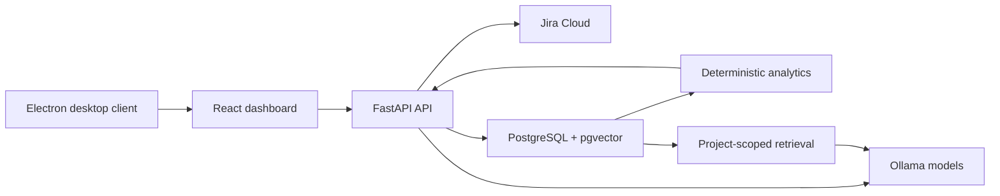
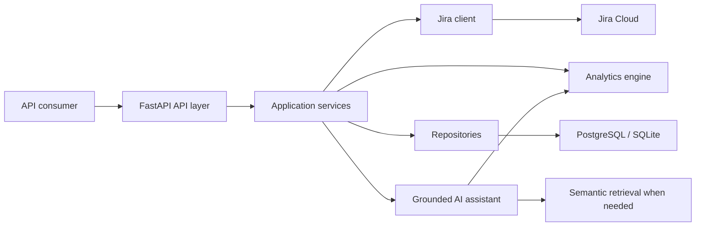

# Jira AI Intelligence

Jira AI Intelligence is an internship full-stack prototype that transforms Jira
Cloud data into project-management analytics and evidence-based AI assistance.

The application retrieves projects, boards, sprints, issues, users, and comments
from Jira. It cleans the Jira responses into validated Python models and exposes
them through a FastAPI REST API. The completed product will calculate operational
metrics and use those deterministic results to ground AI-generated explanations.

> **Project status:** Phases 1 through 12 are complete and verified. The protected
> React dashboard now has a reproducible, private Docker Compose deployment with
> automatic migrations, health checks, PostgreSQL/pgvector, and local Ollama
> connectivity. Post-review hardening now adds Scrum-team/project authorization,
> observable synchronization, and a permission-aware interface that clearly
> guides company administrators, project administrators, and team members.
> Phase 13 Git and portfolio quality is next.
>
> This README is also the project's engineering journal. It will be updated after
> every approved task with implementation decisions, test evidence, limitations,
> and material useful for the internship report.

For a folder-by-folder and file-by-file explanation of the repository, read
[`PROJECT_STRUCTURE.md`](PROJECT_STRUCTURE.md).

For Windows installation, startup behavior, network checks, and company URL
configuration, read [`docs/desktop.md`](docs/desktop.md).

## Problem statement

Jira contains useful project data, but its raw API responses are deeply nested and
do not directly answer management questions such as:

- How much work is assigned to each team member?
- Which issues are overdue or unassigned?
- How close is a sprint to completion?
- Which work is stale or putting delivery at risk?
- What changed recently in a project?

This project aims to provide one backend that collects Jira data, validates it,
computes reliable metrics, and explains those metrics using a grounded local AI
assistant.

## Project objectives

- Integrate securely with Jira Cloud REST APIs.
- Convert complex Jira payloads into clean, typed domain models.
- Expose stable REST endpoints through FastAPI.
- Compute deterministic project and sprint analytics.
- Persist and synchronize Jira data for scalable analytics.
- Add an AI assistant that cites metrics and source issues instead of inventing
  Jira facts.
- Provide a protected, presentation-ready dashboard for viewers and administrators.
- Deliver a tested, documented, containerized, and deployable portfolio project.

## Current architecture



The browser dashboard uses JWT authentication and project-aware navigation. Team
members see only projects owned by their active Scrum teams. Company administrators
manage all projects, while explicit project administrators may synchronize and
index only their assigned projects. Backend authorization remains the true
security boundary; hiding a control in the browser is only a usability measure.

### Target architecture



## Technology register

This section records what each technology contributes and why it was selected.

### Technologies currently in use

- **Python 3.12:** Main programming language. It provides strong typing support,
  a mature API ecosystem, and readable code suitable for an internship project.
- **FastAPI:** REST API framework. It provides automatic OpenAPI documentation,
  validation integration, strong typing, and dependency injection.
- **Requests:** Synchronous HTTP client used to communicate with Jira Cloud.
- **Pydantic:** Validates and serializes cleaned Jira data into typed models.
- **python-dotenv:** Loads local environment variables while keeping credentials
  outside the source code.

### Runtime and testing technologies

- **Uvicorn:** Runs the FastAPI application as an ASGI server. It is now declared,
  installed, and verified by starting the development server.
- **pytest:** Runs meaningful unit, service, route, security, database, AI, and
  synchronization tests with fixtures and mocking.
- **httpx:** Supports HTTP-level testing of FastAPI routes without a live server.
  It is installed and used by the route test suite.

### Technologies adopted in later phases

- **SQLAlchemy:** Models and accesses normalized relational Jira and application
  data.
- **Alembic:** Tracks controlled database schema migrations through revision
  `20260805_08`.
- **PostgreSQL and pgvector:** Persist synchronized Jira data and project-scoped
  vector embeddings.
- **Ollama:** Runs local `llama3.2` answer generation and `nomic-embed-text`
  embeddings without sending company evidence to an external model API.
- **React, TypeScript, and Vite:** Implement the protected dashboard.
- **Electron:** Packages the dashboard as a Windows desktop application with a
  company-network availability check.
- **Docker and Compose:** Package the API and dashboard into reproducible Linux
  images and coordinate PostgreSQL, migrations, health checks, and startup order.
- **Redis:** Not required by the prototype. A shared cache may be introduced only
  if a future multi-worker deployment demonstrates the need.

## Currently implemented functionality

Repository inspection confirms that the active backend currently supports:

- Jira Cloud Basic Authentication using email and API token.
- Shared Jira GET requests with a 20-second timeout.
- Handling for connection, timeout, authentication, permission, missing-resource,
  HTTP, and invalid-JSON failures.
- Retrieval of Jira projects, boards, sprints, users, project issues, individual
  issues, issue comments, and sprint issues.
- Cleaning nested Jira issue data into a flat representation.
- Validation and serialization through the `Ticket` Pydantic model.
- Analytics for status counts, priority counts, issue-type counts, workload,
  sprint completion, and overdue issues.
- FastAPI Swagger documentation at `/docs` while the application is running.

The AI, RAG, database, synchronization, and analytics components are now
implemented. Jira ingestion and persistence are coordinated by
`app/services/sync_service.py`; the obsolete empty ingestion package has been
removed.

## Current API endpoints

The router is mounted under `/api` and contains authenticated `GET` and `POST`
operations. The list below is a compact summary; [`docs/api.md`](docs/api.md) is
the authoritative endpoint guide. Dashboard screens use `/api/stored/...`
reads. `/api/analytics/...` remains only as a deprecated live-Jira diagnostic
family.

### General Jira data

- `/api/` — Return an API status message.
- `/api/projects` — List Jira projects.
- `/api/boards` — Retrieve Jira boards.
- `/api/sprints/{board_id}` — Retrieve sprints for a board.
- `/api/sprints/{sprint_id}/issues` — Retrieve sprint issues.
- `/api/users` — Retrieve Jira users.
- `/api/issues/detail/{issue_key}` — Retrieve one issue.
- `/api/issues/{issue_key}/comments` — Retrieve comments for one issue.
- `/api/issues/{project_key}` — Retrieve issues belonging to a project.

### Analytics

- `/api/analytics/projects/{project_key}/status-counts` — Count issues by status.
- `/api/analytics/projects/{project_key}/workload` — Count issues by assignee.
- `/api/analytics/projects/{project_key}/priority-counts` — Count issues by
  priority.
- `/api/analytics/projects/{project_key}/type-counts` — Count issues by type.
- `/api/analytics/projects/{project_key}/overdue` — Return overdue issues.
- `/api/analytics/projects/{project_key}/overview` — Return a consolidated
  project dashboard summary from one issue fetch.
- `/api/analytics/projects/{project_key}/activity` — Return issue-age, recent,
  oldest-open, and configurable stale-work analytics.
- `/api/analytics/projects/{project_key}/insights` — Return weekly creation,
  label, workload-matrix, grouped-overdue, and blocked-work analytics.
- `/api/analytics/projects/{project_key}/history` — Return weekly completion,
  lead-time, and cycle-time analytics derived from Jira history.
- `/api/analytics/sprints/{sprint_id}/completion` — Calculate sprint completion.
- `/api/analytics/sprints/{sprint_id}/performance` — Return throughput, actual
  story-point velocity when available, carryover, and scope changes.

Canonical stored routes include issues, overview, activity, insights, history,
sprints, sprint performance, and the shared deterministic Risk Center endpoint:
`/api/stored/analytics/projects/{project_key}/risks`.

## Local configuration

The application currently expects these variables in a local `.env` file:

```env
JIRA_BASE_URL=https://your-domain.atlassian.net
JIRA_EMAIL=your-email@example.com
JIRA_API_TOKEN=your-jira-api-token
```

The real `.env` file is ignored by Git. It must never be committed, printed in
logs, included in screenshots, or copied into the internship report. The
committed `.env.example` documents safe placeholders for supported settings.

Current development command:

```powershell
python -m uvicorn main:app --reload
```

Complete local, Docker, and desktop installation instructions are available in
[`docs/deployment.md`](docs/deployment.md) and [`docs/desktop.md`](docs/desktop.md).

## Engineering conventions

The intended responsibility boundaries are:

- **API routes:** validate HTTP input, call one service operation, and return an
  HTTP response.
- **Services:** coordinate use cases and apply business rules.
- **Jira client:** communicate with Jira and understand Jira response envelopes.
- **Domain models:** represent validated internal Jira concepts.
- **API schemas:** define stable public request and response contracts.
- **Analytics engine:** calculate metrics from already-fetched models without
  making HTTP requests.
- **Repositories:** read and write persisted entities after Phase 4.

Development rules:

1. Inspect existing code before proposing a modification.
2. Explain the exact change, files, benefits, risks, and test plan first.
3. Obtain explicit approval before editing files.
4. Make small changes and preserve public response formats where possible.
5. Add or update tests with each behavior change.
6. Never require live Jira access for normal unit tests.
7. Never expose Jira credentials or raw sensitive responses.
8. Record completed work and verification evidence in this README.

## Phase tracker

Legend:

- `[x]` completed and verified
- `[~]` implemented but awaiting full verification
- `[ ]` not completed

### Phase 1 — Stabilize and refactor the backend

- [x] Inspect the actual repository structure and active application path.
- [x] Identify implemented modules versus placeholder modules.
- [x] Confirm `.env` is excluded by `.gitignore`.
- [x] Move overdue endpoint orchestration into `JiraService` and ensure one issue
  fetch per request.
- [x] Keep the verified overdue refactor after review and regression testing.
- [x] Correct runtime and development dependency declarations and verify that the
  dependency resolver installs them without conflicts.
- [x] Add a safe `.env.example`.
- [x] Establish a working Python 3.12 virtual environment and record exact setup
  commands.
- [x] Replace pass-only placeholder tests with meaningful offline tests covering
  configuration, Jira cleaning, analytics, errors, security, pagination,
  persistence, synchronization, authorization, AI, RAG, and API routes.
- [x] Centralize Jira settings in a typed Pydantic Settings model and cache the
  validated result once per application process.
- [x] Avoid constructing the Jira client during module import.
- [x] Introduce FastAPI dependency injection for `JiraService` and verify that an
  API route can replace it without contacting Jira.
- [x] Replace Jira request `print()` calls with safe logs containing resource,
  status, duration, and error category.
- [~] Keep sanitized, consistent HTTP errors in the prototype. Decoupling the
  Jira client from FastAPI exceptions remains an optional architecture cleanup.
- [x] Prevent raw Jira response bodies and connection exception details from
  reaching API consumers or application logs.
- [x] Add endpoint-specific Jira pagination for projects, boards, sprints, users,
  comments, project issues, and sprint issues.
- [x] Verify and use the Jira Agile sprint-issue endpoint.
- [x] Capture Jira `statusCategory` during issue cleaning.
- [x] Replace hardcoded completion status names with status-category logic.
- [x] Extract deterministic calculations into `AnalyticsService`.
- [x] Strengthen return types sufficiently for the configured mypy gate to pass.
- [x] Add `/health` and `/ready` endpoints.
- [x] Run automated unit, service, API, security, and offline integration tests.
  The current suite passes 156 tests; two opt-in PostgreSQL tests skip only when
  their dedicated database URL is absent.
- [x] Run approved live Jira smoke tests for the main project, board, sprint, and
  analytics endpoints.
- [x] Record the Phase 1 baseline and known limitations.

**Phase 1 exit criteria:** A new developer can install and start the application;
tests run without Jira credentials; all Jira collections paginate correctly;
routes are thin; errors and logs are safe; completion logic supports custom Jira
workflows; and existing endpoints pass automated and approved smoke tests.

### Phase 2 — Complete the analytics layer

- [x] Add a consolidated project overview using one fetched issue collection.
- [x] Add completed, open, and unassigned counts and completion rate.
- [x] Add and live-verify issue age, oldest-open, recently-updated, and
  configurable stale-issue metrics against project T1.
- [x] Add and verify weekly created and completed trends. Completion uses Jira's
  actual resolution timestamp.
- [x] Add and live-verify workload matrices and label analytics against T1.
- [x] Add and live-verify overdue grouping by assignee and priority against T1.
- [x] Add and verify velocity, carryover, scope-change, cycle-time, lead-time, and
  throughput metrics where Jira data supports them.
- [x] Implement and verify a documented basic blocked signal using open issues
  whose status or label contains `block`.

**Phase 2 status:** Complete. The deterministic analytics layer is covered by
offline tests and live Jira verification against project T1 and sprints 34, 68,
and 69. History endpoints currently make multiple Jira requests and are expected
to be optimized through persistence and synchronization in Phase 4.

### Phase 3 — Filtering, sorting, and query support

- [x] Add validated status, assignee, priority, type, label, and created-date
  filters; combined status/assignee filtering is live-verified against T1.
- [x] Add and live-verify cursor pagination and allowlisted sorting parameters.
- [x] Construct JQL only from validated fields and escaped quoted values.
- [x] Test malformed and injection-like inputs before Jira is contacted.

**Phase 3 status:** Complete. The test suite reports `44 passed, 7 skipped`, and
real T1 searches verified combined filters, descending sorting, and two distinct
cursor pages. Page one returned T1-30 and T1-29; its token continued with T1-28
and T1-27 on page two.

### Phase 4 — Data persistence and caching

- [x] Design and verify normalized relational entities for projects, issues,
  sprints, changelogs, and synchronization runs.
- [x] Add SQLAlchemy 2.0.51 and Alembic 1.18.5 with a verified initial migration.
- [x] Support and live-verify SQLite and PostgreSQL through database-URL
  configuration, migrations, synchronization, and stored analytics reads.
- [x] Implement and verify idempotent manual full synchronization for projects,
  issues, matching-board sprints, and issue changelogs.
- [x] Implement and verify incremental synchronization using the last completed
  sync as a UTC minute watermark, with safe full-sync fallback.
- [x] Track and verify synchronization mode, status, timestamps, processed
  counts, and sanitized failures.
- [x] Add and verify database-backed issue, overview, activity, and insights reads
  without constructing a Jira client.
- [x] Store and verify sprint-issue memberships and database-backed project
  history and sprint performance.
- [x] Evaluate caching after analytics correctness. Defer it because synchronized
  database reads are already fast and no measured bottleneck justifies added
  cache invalidation complexity in the internship prototype.

PostgreSQL verification uses `compose.yaml` and an ignored `.env.postgres` file.
The Compose service stores data in a named Docker volume and includes a health
check. It does not contain a committed database password. SQLite remains the
default local database until `DATABASE_URL` is explicitly changed.

PostgreSQL infrastructure verification completed on 2026-07-13 using PostgreSQL
17 Alpine in Docker. The container became healthy on port 5432, Alembic applied
revisions `20260712_01` and `20260713_02` with transactional DDL, and the opt-in
PostgreSQL connection test passed.

Application-level PostgreSQL verification also passed: a real T1 full sync
stored issues, 75 changelog histories, three sprints, and sprint memberships in
PostgreSQL, followed by a database-backed project overview returning `200 OK`.

**Phase 4 status:** Complete. The prototype now supports migrated SQLite and
PostgreSQL storage, idempotent full sync, incremental sync, observable sync runs,
and network-free current-state and historical analytics. Caching is deliberately
deferred until performance measurements demonstrate a need.

### Phase 5 — Grounded AI assistant

- [x] Define the first supported project-question contract and structured answer
  schema.
- [x] Build deterministic, project-scoped evidence from synchronized Jira data
  and analytics.
- [x] Integrate free local Ollama with `llama3.2`, JSON-schema output, temperature
  zero, and no cloud API key.
- [x] Return answers, risks, recommendations, limitations, and validated source
  issue keys. Unknown model citations are removed.
- [x] Add mocked grounding, missing-evidence, citation-filtering, completed-issue
  interpretation, and structured Ollama request tests.
- [x] Verify prompt-injection isolation, no-risk behavior, model timeouts, and
  malformed local-model responses. All 10 focused AI tests passed on 2026-07-13.

The first Phase 5 endpoint is `POST /api/ai/projects/{project_key}/ask`. It reads
only synchronized database evidence, never live Jira data. The prompt explicitly
forbids invented facts and treats the user question as data rather than system
instructions. Known evidence limitations are added deterministically after model
generation, and citations not present in the supplied evidence are discarded.
Completed issues are explicitly identified as delivery progress so the model does
not describe completion itself as a risk without a separate negative signal.
Risk questions now use deterministic signals for blocked, overdue, stale,
unassigned, workload-concentrated, and low-completion work. Raw open tickets are
not automatically classified as risks, and risk responses are limited to five
prioritized risks and five recommendations.
The backend also owns the approved recommendation for each risk signal. For
delivery-risk questions it constructs the risks, actions, citations, and readable
answer deterministically instead of trusting model-generated advice. This hybrid
design prevents invented targets and unrelated recommendations; Ollama remains
available for non-risk explanatory questions. Risk responses identify their
generator as `deterministic-risk-engine` instead of incorrectly claiming that
the local model generated the validated content.

Live Ollama verification completed on 2026-07-13 with project `T1` and local model
`llama3.2`. The endpoint returned a structured, grounded response with a validated
`T1-12` citation and deterministic limitations for missing due dates, story-point
estimates, and labels. The first live answer also revealed that the prompt needed
to distinguish completed work from risk; that rule and its regression test were
then added.

Final live T1 risk verification completed on 2026-07-13. The deterministic risk
engine returned three supported risks: four unassigned open issues, 53% of
assigned open work concentrated on one assignee, and a 5% project completion
rate. It returned only matching recommendations and cited `T1-29`, `T1-16`,
`T1-14`, and `T1-10` for the unassigned-work signal. No invented targets or
unrelated best-practice recommendations remained.

**Phase 5 status:** Complete. The prototype combines deterministic, auditable
risk intelligence with local Ollama explanations for non-risk questions, filters
unknown citations, exposes evidence limitations, and sanitizes local-model
failures. Phase 6 will add project-scoped semantic retrieval for questions that
require issue descriptions, comments, and documentation.

Final Phase 5 regression verification completed on 2026-07-13: all 10 focused AI
tests passed, followed by the full suite with 64 passed and 5 intentionally
skipped tests in 1.39 seconds. One known Starlette TestClient/httpx deprecation
warning remains non-blocking and does not affect application behavior.

### Phase 6 — RAG and semantic search

- [x] Confirm which use cases genuinely require semantic retrieval.
- [x] Select a free local embedding model and vector-storage approach:
  `nomic-embed-text` with PostgreSQL and pgvector.
- [x] Chunk issue text and comments with source metadata. Summary, description,
  and persisted-comment support are implemented and verified.
- [x] Store and update embeddings without duplication. The pgvector persistence
  layer and live T1 indexing are verified.
- [x] Retrieve project-scoped evidence for AI questions. Project-filtered cosine
  retrieval and API integration are verified against T1.
- [x] Evaluate retrieval quality with a repeatable dataset. Five live T1 cases
  passed the defined Recall@K and Mean Reciprocal Rank gates.

Phase 6 started on 2026-07-13. RAG will support questions whose answers depend
on unstructured meaning, such as finding tickets that describe similar problems,
summarizing related issue descriptions and comments, explaining recurring themes,
and retrieving supporting project documentation. Deterministic analytics remain
responsible for counts, completion rates, overdue work, workload, and delivery
risk signals; RAG will not replace those reliable calculations.

The first retrieval scope will be synchronized Jira issue summaries,
descriptions, and comments. Every chunk must retain its project key, issue key,
content type, source identifier, and synchronization timestamp so the API can
enforce project isolation and return traceable citations. Empty or duplicate
content must not create embeddings.

The planned implementation order is:

1. Choose and verify a free local embedding model and persistent vector store.
2. Replace the current placeholder RAG modules with a deterministic chunker.
3. Add idempotent indexing tied to the existing Jira synchronization data.
4. Add project-filtered top-k retrieval with similarity scores and citations.
5. Ground Ollama answers in retrieved chunks while preserving the Phase 5 safety
   rules.
6. Create a small evaluation dataset containing relevant, irrelevant, duplicate,
   empty, and cross-project retrieval cases.

Existing files under `app/rag` and the skipped `tests/test_rag.py` are scaffolding,
not completed RAG functionality. They will be reviewed and replaced deliberately
rather than treated as working implementation.

The selected local embedding model is `nomic-embed-text`, served by the existing
Ollama installation. It is approximately 274 MB, requires no cloud API key, and
was successfully loaded on the development GPU on 2026-07-13. `llama3.2` remains
the answer-generation model until Phase 6 is complete.

The first Phase 6 implementation batch replaced the placeholder chunker and
embedding code. Jira summaries and both plain-text and Atlassian document-format
descriptions now produce deterministic chunks with stable SHA-256 identifiers,
project and issue isolation metadata, source type, chunk index, and source update
time. Empty text is skipped. The local embedding client supports batch and query
embeddings, validates response dimensions, and sanitizes timeout, connection, and
malformed-response failures. Persistent vector storage is intentionally deferred
to the next batch so its PostgreSQL migration can be reviewed independently.

Phase 6 foundation verification completed on 2026-07-13. All six implemented RAG
tests passed and the vector-retrieval test remained intentionally skipped. The
full regression suite then passed with 70 tests, 3 intentional skips, and the
existing non-blocking Starlette TestClient/httpx deprecation warning.

The second Phase 6 implementation batch prepares persistent semantic storage
with pgvector 0.8.2 on PostgreSQL 17. The `rag_chunks` schema stores 768-dimension
`nomic-embed-text` vectors beside traceable Jira chunk content and metadata.
Synchronization upserts stable chunk identifiers, removes obsolete chunks only
within the selected project, and prevents duplicate accumulation. Retrieval uses
cosine distance with a mandatory project-key filter, a bounded result limit, and
validated vector dimensions.

The code, Alembic migration, official pgvector Docker image, and tests are
applied to the development database. A PostgreSQL backup was created before the
container moved to the official `pgvector/pgvector:0.8.2-pg17` image. Alembic
revision `20260713_03` enabled the vector extension and created `rag_chunks`
without losing the existing synchronized Jira data. SQLite remains supported for
existing non-RAG development; vector indexing and search fail explicitly outside
PostgreSQL rather than returning misleading results.

Persistent-vector verification completed on 2026-07-13. Eleven focused database,
PostgreSQL, chunking, embedding, idempotency, similarity-ordering, and
cross-project-isolation tests passed. The full regression suite then passed with
73 tests, 1 intentional skip, and the existing non-blocking Starlette
TestClient/httpx deprecation warning. The remaining skipped test belongs to the
unfinished higher-level RAG pipeline.

The third Phase 6 implementation batch adds application-level indexing and search.
`POST /api/rag/projects/{project_key}/index` reads only synchronized database
issues, chunks summaries and descriptions, creates local embeddings in bounded
batches, replaces obsolete vectors for that project, and commits atomically.
`POST /api/rag/projects/{project_key}/search` embeds the question and returns
project-filtered chunks with similarity values and Jira source metadata. Both
routes use dependency injection so automated tests do not contact live Jira or
Ollama. Live T1 indexing processed 20 stored issues into 20 chunks.

The first live semantic-search evaluation exposed an important retrieval-quality
lesson. The initial implementation embedded both documents and questions as raw
text, but `nomic-embed-text` requires retrieval task instructions. Index content
now uses `search_document:` and user questions use `search_query:`. T1 was
re-indexed after this correction. For the test question "The AI invents Jira
issues that do not exist," the correct issue, T1-22 "AI hallucinating missing
tickets," ranked sixth of 20 with cosine similarity 0.588975. This confirms that
the relevant evidence enters a top-ten candidate set, while also showing that
raw vector top-three ranking is insufficient for very short Jira summaries.

The fourth Phase 6 implementation batch adds grounded answer generation at
`POST /api/rag/projects/{project_key}/ask`. It retrieves ten project-scoped
candidates, supplies only that Jira evidence to the local `llama3.2` model, and
requires traceable issue-key citations. The application removes invented,
duplicate, or out-of-candidate citations. If no supported citation remains, it
replaces the generated text with an explicit insufficient-evidence response.
The raw `/search` endpoint remains available for retrieval inspection. Automated
and live verification results are recorded below.

Live grounded-answer verification succeeded against T1 on 2026-07-14. For the
question "Which Jira issue describes the AI inventing tickets that do not
exist?", the endpoint retrieved ten project-scoped chunks and the local
`llama3.2` model answered "AI hallucinating missing tickets" with T1-22 as its
only source issue key. The response contained no limitations and reported
`grounded: true`. This demonstrates the intended retrieve-then-answer behavior:
although T1-22 ranked sixth in raw vector search, it was present in the bounded
candidate set and the grounded answer layer selected the directly relevant Jira
evidence without inventing an issue key.

Automated verification of the fourth Phase 6 batch also completed on 2026-07-14.
All 31 focused RAG, API, and AI tests passed in 1.47 seconds. The complete
regression suite then passed with 80 tests, 3 intentional skips, and the existing
non-blocking Starlette TestClient/httpx deprecation warning in 2.48 seconds.
Together with the successful live T1 response, this verifies document/query task
prefixes, project-scoped retrieval, top-ten candidate answering, structured local
model output, citation filtering, missing-evidence handling, API validation, and
regression safety.

An exact-key accuracy correction was completed on 2026-08-03 after the question
"What does issue T1-22 describe?" was incorrectly ranked toward T1-26 by vector
similarity. Questions that explicitly contain Jira keys now bypass embeddings
and the language model, use a project-scoped exact PostgreSQL lookup, and return
only verified fields from the named issues. Cross-project and missing keys are
rejected honestly, and comparisons support up to five explicit keys. Live Docker
verification returned T1-22 as "AI hallucinating missing tickets" with only
T1-22 cited. The complete regression suite passed with 116 tests and two
PostgreSQL-only skips.

Follow-up dashboard verification found a second contradiction: the model said
that no evidence supported "Which tickets discuss AI reliability?" while citing
all ten retrieved candidates. Semantic listing requests containing terms such as
"mentions," "discusses," or "related to" now use bounded deterministic ranking
instead of asking the model to restate search results. Matches must remain within
0.12 of the best score and above 0.5, are deduplicated by issue key, and are
limited to five. Model answers that claim insufficient evidence now have all
citations removed. Live verification selected T1-25 for pagination, T1-22 and
T1-16 for AI reliability, and T1-15 and T1-30 for sprint completion. The updated
suite passed with 118 tests and two PostgreSQL-only skips.

Informal Scrum-question verification added another accuracy layer. Semantic
listing results now require meaningful word overlap in addition to vector
similarity, with fuzzy comparison for small spelling mistakes. This rejects a
high-scoring but unsupported login result when no synchronized issue mentions
login, while still matching `compltion` to `completion`. Results are reranked by
the number of supported query terms before vector score. Informal questions
about work that "nobody assigned" and who has "too much work" now use exact
assignment analytics rather than RAG. The dashboard evidence panel displays only
issues cited by the final answer and hides rejected raw candidates. Verification
completed with 122 backend tests, two PostgreSQL-only skips, six frontend tests,
a successful production build, and clean Ruff and mypy checks.

The fifth Phase 6 implementation batch adds the remaining comment and evaluation
foundations. A new idempotent `comments` persistence table retains Jira comment
identifiers, authors, Atlassian document-format bodies, and timestamps beneath
their issues. Full synchronization replaces each issue's comment snapshot so
deleted comments do not remain in the database, while repeated synchronization
does not create duplicates. Sync-run records now report `comments_processed`.
RAG indexing reads comments only from synchronized storage, converts their Jira
document format to text, and preserves the comment ID, author, issue key, content
type, and update time in every chunk. Alembic revision `20260714_04` applies this
schema change without modifying existing issue or vector records.

A repeatable retrieval dataset now defines five T1 questions with expected Jira
issue keys, including the difficult hallucinated-ticket wording that previously
placed T1-22 sixth. The local evaluation command calculates Recall@K and Mean
Reciprocal Rank rather than relying on visual judgment. Its default acceptance
gate requires at least 0.8 Recall@K and 0.5 Mean Reciprocal Rank. The migration,
automated tests, full comment-aware synchronization, re-indexing, and live
evaluation results are recorded below.

Automated verification of the fifth Phase 6 batch completed on 2026-07-14. All
34 focused database, synchronization, stored-data, RAG, retrieval-evaluation,
and API tests passed in 2.44 seconds. The complete regression suite then passed
with 84 tests, 3 intentional skips, and the existing non-blocking Starlette
TestClient/httpx deprecation warning in 1.54 seconds.

Final Phase 6 live verification completed on 2026-07-14. Alembic revision
`20260714_04` was confirmed as the PostgreSQL head. A full T1 synchronization
completed with 20 issues, 3 sprints, 80 changelog records, and 0 comments. Zero
comments is a property of the current T1 Jira data, not a synchronization error;
non-empty comment persistence and chunking are covered by automated tests. The
project was then re-indexed into 20 `nomic-embed-text` chunks.

The five-case live retrieval evaluation achieved 5 hits from 5 cases, Recall@K
of 1.0, and Mean Reciprocal Rank of 0.8333. Authentication, pagination, sprint
completion, and workload questions placed their expected issue first. The more
semantic hallucinated-ticket question placed T1-22 sixth, but inside the bounded
top-ten candidate set used by grounded answer generation. Both acceptance gates
were exceeded: Recall@K was required to be at least 0.8 and Mean Reciprocal Rank
at least 0.5. Phase 6 is therefore complete, with raw ranking improvement for
short summaries retained as a future optimization rather than a release blocker.

A final Phase 6 reliability correction was verified on 2026-07-23. Sprint-list
and sprint-count questions require authoritative sprint membership data, so the
RAG ask service now detects these questions and directs callers to
`GET /api/analytics/projects/{project_key}/sprints` without running embeddings or
the language model. This prevents semantic retrieval from guessing structured
counts. The deterministic endpoint was live-verified against T1, returning three
sprints with their state, issue count, completed count, open count, and completion
rate. The live RAG routing check returned `deterministic-question-router`, zero
retrieved chunks, and the correct endpoint guidance. Focused analytics, API, and
RAG verification passed with 43 tests and 1 intentional skip. The complete
regression suite passed with 88 tests, 3 intentional skips, and the existing
non-blocking Starlette TestClient/httpx deprecation warning.

### Phase 7 — Authentication and authorization

- [x] Select portfolio authentication scope.
- [x] Add PostgreSQL-backed prototype users with `viewer` and `admin` roles.
- [x] Hash passwords with Argon2 and issue short-lived signed JWT access tokens.
- [x] Protect business endpoints and reserve synchronization and RAG indexing for
  administrators.
- [x] Configure explicit CORS origins and basic process-local rate limiting.
- [x] Document the production evolution toward company SSO/OIDC.
- [x] Apply migration `20260723_05`, create live viewer/admin users, and complete
  Postman verification.
- [x] Add optional first name, last name, and unique email profiles without
  breaking existing username-only accounts.
- [x] Present the internal `viewer` role as **Team Member** in the dashboard while
  preserving the established backend authorization contract.
- [x] Add Scrum teams, active multi-team membership, one owning team per project,
  and explicit project-administrator assignments.
- [x] Restrict project discovery and all direct or indirect project resources to
  the authenticated user's authorized project set.
- [x] Add company-admin dashboard controls for team creation, project ownership,
  membership, and per-project administration.

Phase 7 uses local accounts only to demonstrate authentication and role-based
authorization in the internship prototype. There is no public registration
endpoint. Accounts are created through an interactive command that reads the
password without displaying it or placing it in shell history. Passwords are
stored only as Argon2 hashes.

`POST /api/auth/login` validates a username and password and returns a signed
JWT with a configurable lifetime. `GET /api/auth/me` returns the authenticated
identity. All other `/api` business routes require a bearer token. Company
administrators can access every synchronized project. Team Members can read only
projects owned by their active Scrum teams, while an explicit project
administrator can synchronize and rebuild the RAG index for that project only.
Knowing or typing a project key never grants access.

The prototype represents one company. Each Jira project has one owning Scrum
team, one team may own multiple projects, and a person may belong to multiple
teams. Scrum responsibilities such as developer, QA, Product Owner, and Scrum
Master are recorded as descriptive membership metadata rather than security
roles. The global company administrator remains responsible for team membership,
project ownership, and project-administrator assignments.

The API verifies the token signature, required claims, expiry, database user,
active state, and current database role on every authenticated request. Checking
the database prevents a disabled user or changed role from continuing to use an
old token. Failed logins return one generic message so callers cannot discover
whether a username exists.

Migration `20260803_06` adds optional human profile fields. The interactive user
command accepts `--first-name`, `--last-name`, and `--email`; running it again for
an existing username updates that account. The dashboard displays the person's
name and initials when available and falls back to the username otherwise.

CORS accepts only explicitly configured frontend origins and rejects wildcard
configuration. Basic rate limits protect login, local AI/RAG calls,
synchronization, and RAG indexing. The limiter is intentionally process-local
for this single-instance prototype. A production deployment with multiple
workers would move rate limiting to Redis, an API gateway, or the company edge
platform.

Production would not retain these local passwords. It would delegate identity
verification to the company's SSO provider using OpenID Connect, validate the
company-issued access token, and map company groups or claims to the same viewer
and administrator authorization rules. The authorization boundary therefore
remains useful when local login is replaced.

Automated Phase 7 verification currently includes anonymous denial, Argon2
hashing, successful and failed login, identity retrieval, expired-token denial,
viewer/admin separation, rate limiting, restrictive CORS, dependency isolation,
and complete regression coverage. The focused security/configuration/API suite
passed 21 tests. The most recent complete suite passed 97 tests with 3
intentional skips and the existing non-blocking Starlette TestClient/httpx
deprecation warning.

Final Phase 7 live verification completed on 2026-07-23. PostgreSQL migration
`20260723_05` was confirmed as the active head. Interactive bootstrap commands
created active `viewer-demo` and `admin-demo` accounts without exposing their
passwords. A live viewer login returned a bearer access token, and the viewer
successfully retrieved the 20 synchronized T1 issues from a protected stored-data
route. Viewer denial and administrator access for the privileged RAG-index
operation were also verified. Phase 7 is therefore complete. The local accounts
remain a prototype identity mechanism; company SSO/OIDC is the documented
production replacement.

### Phase 8 — Testing

- [x] Measure line and branch coverage across implemented application code.
- [x] Establish an automated minimum coverage gate of 80%.
- [x] Test Jira failures, pagination, missing fields, and invalid dates.
- [x] Test duplicate-call prevention and stable response models.
- [x] Test deterministic AI evidence, grounding, and malformed requests.
- [x] Expand authentication, authorization, CORS, and rate-limit negative paths.
- [x] Run PostgreSQL and pgvector integration tests without skips.
- [x] Remove the obsolete empty sprint-health placeholder test.

Testing begins in Phase 1 and continues throughout development; Phase 8 is the
dedicated completeness and quality review.

Phase 8 completed on 2026-08-01. `pytest-cov` is now a declared development
dependency and `.coveragerc` measures both statements and branches while failing
the build below 80% total coverage. The final all-inclusive run enabled the
PostgreSQL and pgvector tests and completed with 110 passed tests, zero skips,
and one known non-blocking Starlette TestClient/httpx deprecation warning.
Combined branch coverage reached 83.56%, exceeding the required gate.

The most important improvement was direct testing of `EvidenceService`, which
builds the deterministic facts supplied to the AI layer. Its coverage increased
from 10% to 96%, including blocked, overdue, stale, unassigned, workload-
concentration, low-completion, and missing-field cases. Security tests now prove
that malformed tokens, expired tokens, disabled users, changed database roles,
invalid CORS wildcards, and expired rate-limit windows are handled safely.

The review also exposed and fixed one real defensive defect: an unsupported or
corrupted stored password hash previously raised `pwdlib.UnknownHashError`.
Password verification now treats that condition as a failed credential check,
so login returns a controlled authentication failure rather than crashing.

Zero-coverage legacy scaffolding such as the unused ChromaDB and memory adapters
was not given artificial tests. It is recorded for deletion or deliberate
retention during Phase 9 code-quality cleanup.

### Phase 9 — Code quality

- [x] Add `pyproject.toml`.
- [x] Configure Ruff formatting and linting.
- [x] Configure mypy and local pre-commit hooks.
- [x] Remove confirmed unreferenced placeholder scaffolding.
- [x] Resolve all Ruff and mypy findings in implemented code.
- [x] Split the large API route module by responsibility without changing URLs.

Ruff now enforces Python 3.12 formatting, import order, common correctness
rules, safe modernizations, and selected bug-risk checks. Mypy validates the
implemented `app`, `main.py`, and `scripts` modules. The local pre-commit
configuration runs both tools before a commit.

The cleanup removed empty placeholder modules that were never imported and had
no runtime responsibility. This reduces misleading architecture, avoids fake
coverage work, and makes the repository easier to explain during the internship
evaluation. Small typing corrections were also made around nullable Jira dates,
SQLAlchemy engine options, Pydantic environment settings, RAG response objects,
sync-run invariants, and authenticated roles. These corrections do not change
the public API.

The former 622-line route module is now a small authenticated composition root.
AI/RAG, stored data, synchronization, direct Jira, and analytics endpoints live
in focused route modules with descriptive OpenAPI tags. The application now
publishes 56 OpenAPI paths with viewer/admin dependencies kept at the backend
boundary.

Verification after cleanup:

- Ruff lint: passed with no findings.
- Ruff format check: passed.
- Mypy: passed with no issues across 53 source files.
- Offline suite: 156 passed and two PostgreSQL tests skipped when the database
  environment variable was absent.
- PostgreSQL and pgvector integration suite: two passed when run against the
  local Compose database.
- Combined statement and branch coverage: 83.85%, above the required 80% gate.

See [docs/code-quality.md](docs/code-quality.md) for commands and design choices.

### Phase 10 — Dashboard and documentation

- [x] Establish this living README and engineering journal.
- [x] Implement a protected, responsive internship demonstration dashboard.
- [x] Add overview charts, issue search, sprint detail, risk and team views,
  AI/RAG questions with supporting Jira evidence, and administrator controls.
- [x] Add route-level code splitting, frontend unit tests, and a verified
  production build.
- [x] Show data freshness, RAG-index health, synchronization progress, and
  deterministic notifications.
- [x] Add clickable Jira issue keys and a safe synthetic demo mode that never
  loads company Jira data. CSV and print-to-PDF controls were later removed to
  keep the operational interface focused.
- [x] Complete dashboard usage, security, architecture, endpoint, limitation,
  demonstration, and roadmap documentation.
- [x] Complete browser verification of login, overview, risks, team workload,
  sprint detail, notifications, and the AI evidence panel.
- [x] Route structured sprint questions to synchronized analytics so neither
  Ollama nor semantic retrieval can confuse the eight-week reporting window
  with the number of sprints.
- [x] Poll a minimal project freshness marker every 15 seconds, automatically
  refetch selected-project views after an administrator sync, and show a short
  **Project data updated** notice to active Team Members.
- [x] Prevent stale dashboard bundles after container upgrades by disabling
  entry-page caching and returning `404` for obsolete hashed assets.
- [x] Route issue priority, status, assignee, and issue-type questions to exact
  synchronized database fields, including small wording and spelling mistakes,
  instead of asking the language model to infer structured Jira facts.
- [x] Replace the disabled demo selector with an interactive project switcher
  that clearly separates synthetic demonstration data from authorized Jira
  projects.
- [x] Present synchronization changes, team membership, owning-team selection,
  and project-administrator management in focused, keyboard-dismissable modal
  windows with confirmation before access removal.
- [x] Redesign AI output into a clear answer summary, measured-risk cards,
  numbered recommendations, authoritative Jira sources, collapsible evidence,
  and an explicit limitations panel.
- [x] Refine the dashboard with a Jira-aligned blue, navy, neutral, success,
  warning, and AI-accent palette plus responsive and visible focus states.

The dashboard is in `frontend/` and uses React, TypeScript, Vite, TanStack Query,
Recharts, Tailwind CSS tooling, and a small client-side router. It reuses the
existing FastAPI JWT login, project endpoints, stored analytics, sprint data,
grounded AI/RAG endpoints, and administrator-only sync endpoints.

Frontend verification completed with fourteen passing Vitest tests, a successful
strict TypeScript production build, route-level code splitting, and a complete
desktop browser walkthrough. The most recent successful dependency audit found
zero known production vulnerabilities; rerun the audit when registry access is
available. See
[docs/dashboard.md](docs/dashboard.md) for the design, commands, and security
boundaries.

### Phase 11 — Docker and deployment

- [x] Add separate production images and Docker ignore policies for FastAPI and
  the React dashboard.
- [x] Add a four-service Compose stack for PostgreSQL/pgvector, one-time Alembic
  migrations, the API, and the Nginx-served dashboard.
- [x] Add non-root application processes, explicit startup dependencies,
  localhost-only published ports, and container health checks.
- [x] Connect the containerized backend to host-managed Ollama without sending
  Jira evidence to a cloud model.
- [x] Select the safe internship target: Docker Desktop or a private internal
  Linux host, not public student hosting.
- [x] Document configuration, operation, backup, restore, update, and rollback
  procedures without exposing credentials.

Live verification used temporary ports so existing development servers were not
interrupted. PostgreSQL, FastAPI, and Nginx all reached healthy state; Alembic
completed before API startup; the dashboard proxied `/health` successfully; and
the backend container reached Ollama 0.31.2. See
[docs/deployment.md](docs/deployment.md) for the operator guide.

### Phase 12 — Security

- [x] Ignore `.env` in Git.
- [x] Complete secrets, dependency, logging, and stored-data reviews.
- [x] Enforce measured request-body limits, restrictive CORS, rate limits,
  no-store API caching, browser headers, and dashboard content security policy.
- [x] Verify JQL allow-listing, project-scoped retrieval, citation filtering,
  administrator boundaries, and prompt-injection failure paths.
- [x] Document privacy limits, mitigations, production requirements, and residual
  risks in [docs/security.md](docs/security.md).
- [x] Add centralized project/team authorization and close cross-project access
  through project, issue, sprint, sync, analytics, AI, and RAG endpoints.
- [x] Escape project values in direct Jira JQL construction and add adversarial
  regression tests.
- [x] Detect newer Jira issue data with a cached lightweight freshness query and
  display **Updates available — sync required** to authorized dashboards.
- [x] Persist issue-level details for every full or incremental sync, including
  created, updated, or unchanged classification, changed fields, before/after
  values, and inspected comment/changelog counts.
- [x] Add an expandable synchronization audit view and a manual administrator
  **Check Jira for updates** action.

**Phase 12 status:** Complete. Python and npm audits found zero known runtime
vulnerabilities, Bandit has no unaddressed findings, and private environment
files remain untracked. The latest gate passed with `146 passed, 2 skipped`, 12
frontend tests, four desktop configuration tests, clean Ruff/mypy/Bandit checks,
successful frontend and Electron production builds, and zero known Python,
frontend npm, or desktop npm dependency vulnerabilities. Compose configuration
is valid; live container health was not rerun on 2026-08-12 because Docker
Desktop was stopped. Security remains continuous work.

### Windows desktop release

- [x] Wrap the protected React application in a hardened Electron client.
- [x] Add a startup company-service check, a network/VPN-required page, and
  recovery through **Retry connection**.
- [x] Add Windows start-on-login behavior for installed builds only.
- [x] Enforce a single application instance and focus the existing window.
- [x] Create versioned Squirrel installers and reproducible output directories.
- [x] Add a custom Jira AI Intelligence application and installer icon.
- [x] Support IT-managed company URLs through a non-secret ProgramData JSON
  file, with environment-variable overrides for controlled testing.
- [x] Add desktop configuration unit tests and syntax/security gates.

Desktop release `1.0.4` is the polished internship build. Its installer is
documented in [docs/desktop.md](docs/desktop.md). The prototype executable is
not code-signed; a company deployment must sign it with a trusted publisher
certificate.

### Phase 13 — Git and portfolio quality

- [ ] Add CI, license, changelog, issue templates, and pull request template.
- [x] Add synthetic Jira data and a recruiter-friendly safe demonstration mode.
- [ ] Prepare screenshots, a demonstration script, and presentation material.
- [~] Architectural decisions are documented; a reviewed Git baseline and
  meaningful commits still need to be created.

## Current technical-debt register

### Remaining before portfolio handoff

- **TD-012 — Git baseline:** Most completed project files are not yet recorded in
  meaningful commits. The reviewed source must be committed before submission.
- **TD-013 — Test-client transition:** FastAPI's current test client emits a
  Starlette HTTPX compatibility deprecation warning. Tests pass; dependency
  migration can wait until the supported replacement is stable.
- **TD-006 — Framework coupling:** `JiraClient` still maps failures to FastAPI
  `HTTPException` objects. This is acceptable for the prototype, but a larger
  system should use application exceptions and centralized HTTP translation.

### Resolved during the internship

- Runtime and test dependencies are declared and reproducible.
- Placeholder tests and unused scaffolding were replaced or removed.
- Typed settings and dependency injection prevent Jira construction at import.
- Jira pagination and Agile sprint endpoints are implemented and tested.
- Jira status categories drive completion logic.
- Public Jira errors are sanitized and requests use safe structured logging.
- AI, RAG, persistence, synchronization, and project authorization are fully
  implemented rather than remaining placeholder packages.

## Decision log

### ADR-001 — Stabilize deterministic backend behavior before AI

**Decision:** Complete Jira integration, models, analytics, tests, configuration,
and pagination before adding an LLM.

**Reason:** An AI assistant can only be trustworthy when its source data and
metrics are correct. Otherwise it would explain incomplete or inaccurate Jira
results convincingly.

### ADR-002 — Keep routes thin

**Decision:** Routes should delegate use cases to services and should not contain
analytics algorithms.

**Reason:** This makes business logic reusable, testable without HTTP, and easier
to change without breaking the public API.

### ADR-003 — Fetch once, calculate many times

**Decision:** Composite analytics should fetch a Jira issue collection once and
pass it to pure calculation functions.

**Reason:** Repeated Jira calls increase latency, consume rate limits, and can
produce inconsistent calculations if Jira changes between requests.

### ADR-004 — Treat generated directory structure as scaffolding until verified

**Decision:** A file or module is not counted as implemented merely because it
exists.

**Reason:** The repository currently contains many empty files and placeholder
methods. Status reporting must be based on working, connected, tested behavior.

## Verification log

Entries below are point-in-time engineering records. Earlier statements about
missing dependencies, placeholder modules, or lower test counts describe the
repository on that date and are not the current project status.

### 2026-08-13 — Dashboard interaction refinement

- Added an always-clickable demo and authorized-project switcher.
- Added a reusable accessible modal workflow for sync details and company
  access administration.
- Added removal confirmation and focused team, member, and project-admin
  management windows.
- Improved the information hierarchy and traceability of AI analytics output.
- Removed prescriptive AI example questions so Jira Knowledge remains an
  open-ended evidence search; temporary local-model failures now offer a retry.
- Applied a Jira-aligned visual palette and verified the redesigned demo and AI
  workflows in a local browser with no console errors.
- Verified all 14 frontend tests and the strict TypeScript/Vite production
  build passed; rebuilt the Compose frontend and confirmed all services healthy.

### 2026-08-12 — Desktop polish and final verification

- Added custom PNG and multi-resolution ICO assets for the application,
  taskbar, executable, and Windows installer.
- Added tested machine-wide company URL configuration under ProgramData without
  storing credentials or Jira data on employee devices.
- Verified 146 backend tests passed and two opt-in PostgreSQL tests skipped.
- Verified all 12 frontend tests and the strict TypeScript/Vite production
  build passed.
- Verified all four desktop configuration tests and JavaScript syntax checks
  passed.
- Verified Ruff, mypy, Bandit, `pip check`, and Python dependency audit passed.
- Remediated three transitive frontend build-tool advisories; frontend and
  desktop npm audits now report zero vulnerabilities.
- Built `Jira AI Intelligence` desktop release `1.0.4` successfully, including
  the Windows GPU-artifact workaround and legacy startup-entry migration.
- Recorded installer SHA-256
  `0929670C2E17388B4BF941495A71BEC19E40CDCC118120148B72E2DBF59C3E60`.
- Confirmed the Compose model is valid. Live container endpoints were
  unavailable because Docker Desktop was intentionally stopped.

### 2026-07-12 — Initial repository audit

- Inspected active routes, Jira client, service, models, schemas, dependencies,
  tests, documentation, and project tree.
- Identified the active Jira and basic analytics core.
- Confirmed that the advanced packages are mostly placeholders.

### 2026-07-12 — Overdue endpoint refactor

- Ran Python `compileall` over `app` and `main.py`.
- Result: passed.
- Attempted to run the focused tests.
- Result: blocked because pytest is not installed.

### 2026-07-12 — Living project README

- Compared the documented features with the inspected repository state.
- Created the phase tracker, decision log, technical-debt register, engineering
  journal, and internship-report evidence bank.
- Removed tables to improve readability on request.

### 2026-07-12 — Dependency and environment inspection

- Discovered that the existing `.venv` points to a Python 3.12 executable that no
  longer exists, so it cannot run Python or report installed packages.
- Replaced transitive HTTP package pins with the application's direct runtime and
  test dependencies using bounded compatibility ranges.
- Added a safe `.env.example` containing placeholders only.
- Dependency installation and application compatibility remain unverified until
  a new virtual environment is created.

### 2026-07-12 — Environment stabilization verified

- Recreated `.venv` using Python 3.12.6.
- Upgraded pip to 26.1.2.
- Installed all direct runtime and test dependencies from `requirements.txt`.
- Installed FastAPI 0.139.0, Uvicorn 0.51.0, Pydantic 2.13.4, Requests 2.34.2,
  python-dotenv 1.2.2, HTTPX 0.28.1, and pytest 9.1.1.
- Ran `python -m pip check`; result: `No broken requirements found.`
- Ran `python -m pytest -q`; result: `17 passed in 0.48s`.
- Imported `main.app`; result: application title was
  `Jira AI Intelligence API`.
- Started Uvicorn successfully and loaded `/docs`; result: HTTP 200.
- Testing is only partially complete because most collected test functions still
  contain placeholder `pass` statements.

### 2026-07-12 — First meaningful offline testing batch

- Added deterministic in-memory Jira tickets without contacting Jira Cloud.
- Verified workload grouping, including unassigned issues.
- Verified status, priority, and issue-type counts, including missing values.
- Verified sprint completion totals, remaining work, and completion percentage.
- Verified overdue filtering for past, future, completed, and missing due dates.
- Verified that overdue summary analytics fetch project issues once.
- Verified complete Jira issue cleaning from nested data into the flat internal
  representation.
- Verified that missing optional Jira fields are handled safely.
- Ran the Jira and analytics files together; result: `16 passed in 0.44s`.
- Ran the complete suite; result: `25 passed in 0.40s`.
- Of the 25 collected tests, 10 contain meaningful assertions and 15 remain
  placeholders that pass without testing behavior.

### 2026-07-12 — Jira failure-handling tests

- Mocked `requests.get` so no test contacted Jira Cloud.
- Verified Jira request timeouts are translated to HTTP 504.
- Verified connection failures are translated to HTTP 503.
- Verified authentication failures are translated to HTTP 401.
- Verified permission failures are translated to HTTP 403.
- Verified missing Jira resources are translated to HTTP 404.
- Verified invalid Jira JSON is translated to HTTP 502.
- Ran `tests/test_jira.py`; result: `11 passed in 0.65s`.
- Ran the complete suite; result: `31 passed in 0.56s`.
- The suite now contains 16 meaningful tests and 15 placeholder tests.
- Generic Jira HTTP errors still expose `response.text`; this remains a known
  security and API-consistency issue rather than behavior to preserve in a test.

### 2026-07-12 — FastAPI dependency injection

- Removed global `JiraService()` construction from the routes module.
- Added a FastAPI dependency that creates the Jira service only for endpoints that
  require it.
- Updated all existing Jira-backed routes without changing their paths or response
  models.
- Added a fake Jira service for the `/api/projects` test.
- Verified that the API route returns fake project data without credentials,
  internet access, or a live Jira request.
- The focused API test passed.
- The full suite remained at `31 passed in 0.47s` because one placeholder test was
  replaced rather than adding another collected test.
- The suite now contains 17 meaningful tests and 14 placeholders.
- Pytest emitted one Starlette deprecation warning related to HTTPX; this did not
  fail the tests and will be investigated separately.

### 2026-07-12 — Centralized typed configuration

- Added Pydantic Settings 2.14.2 as the application configuration provider.
- Moved Jira URL, email, and API-token loading out of `JiraClient`.
- Added typed validation for the Jira base URL and required values.
- Represented the Jira token as `SecretStr` to reduce accidental disclosure.
- Removed the plain `client.api_token` attribute.
- Allowed tests to inject safe explicit settings without reading the real `.env`.
- Cached validated settings once per application process.
- Ran three focused configuration tests; all passed.
- Ran the complete suite; result: `34 passed in 0.61s` with the existing
  non-fatal Starlette test-client warning.
- The suite now contains 20 meaningful tests and 14 placeholders.

### 2026-07-12 — Safe Jira logging and sanitized errors

- Replaced Jira request `print()` statements with Python logging.
- Added safe resource, HTTP status, request-duration, and error-category fields.
- Excluded credentials, authentication headers, query parameters, and raw response
  bodies from logs.
- Removed exception-text interpolation from generic connection errors.
- Replaced unexpected Jira response bodies with a controlled public message.
- Added a test using a secret-like upstream body and verified that it appeared in
  neither the API error nor captured logs.
- Ran the focused sanitization test; it passed.
- Ran the complete suite; result: `35 passed in 0.57s` with the existing
  non-fatal Starlette test-client warning.
- The suite now contains 21 meaningful tests and 14 placeholders.

### 2026-07-12 — Pagination batch 1

- Added reusable offset pagination for Jira responses containing `values` or
  `comments` collections.
- Added array pagination for the Jira user-search response.
- Paginated projects, boards, board sprints, users, and issue comments.
- Preserved Jira-style response envelopes for boards and sprints while combining
  all returned values.
- Added stopping guards for empty pages, `isLast`, known totals, short pages,
  repeated offsets, and non-progressing offsets.
- Added offline tests for multi-page projects, boards, users, and comments.
- Ran `tests/test_jira.py`; result: `16 passed in 0.54s`.
- Ran the complete suite; result: `39 passed in 0.55s` with the existing
  non-fatal Starlette test-client warning.
- The suite now contains 25 meaningful tests and 14 placeholders.

## Internship report evidence bank

The following points can be developed into formal report chapters as the project
progresses.

### Context and motivation

- Jira is widely used to track software work but its REST representation is not a
  management dashboard or an explanatory assistant.
- Project stakeholders need summaries and risks without manually inspecting every
  issue.
- The project combines API integration, backend engineering, analytics, data
  engineering, and grounded generative AI.

### Initial-state assessment

- The Jira connection and several endpoints were operational.
- Jira issue payloads were already cleaned into a useful Pydantic model.
- Basic analytics existed but were tightly coupled to the Jira service.
- Fixed page sizes made large-project analytics incomplete.
- Tests and advanced modules were mainly placeholders.
- Configuration, dependency management, documentation, and error boundaries
  required stabilization.

### Engineering challenges to discuss

- Jira endpoints do not all use identical pagination response shapes.
- Jira workflows use custom status names, so completion must use status categories.
- Analytics should reuse one consistent data snapshot.
- External API failures must be translated without leaking sensitive details.
- AI answers must remain grounded in deterministic data and expose evidence.
- The portfolio prototype must balance enterprise practices with manageable scope.

### Expected contributions

- A typed Jira integration layer.
- A reusable deterministic analytics engine.
- A synchronization and persistence design.
- Evidence-based AI project explanations.
- Automated quality controls and reproducible deployment.
- Architecture and technical documentation suitable for future developers.

### Report artifacts to collect over time

- Before-and-after architecture diagrams.
- Sequence diagrams for Jira retrieval, synchronization, and AI queries.
- Jira pagination and error-handling test results.
- API examples and Swagger screenshots without personal data.
- Analytics validation examples using mock datasets.
- Performance measurements before and after caching.
- AI grounding evaluation cases.
- Deployment diagram and CI results.
- Security and privacy assessment.

## Engineering journal

### 2026-07-12 — Repository audit

The repository was inspected before further development. Although its directory
structure suggests a broad AI analytics platform, only the Jira/FastAPI/basic
analytics path is substantially implemented. The audit counted 117 `pass`
statements and nine empty Python files across the application and tests. This led
to the decision to stabilize the working core rather than continue building on
unverified scaffolding.

### 2026-07-12 — Initial overdue analytics refactor

The overdue API route originally fetched issues and performed filtering itself,
even though overdue behavior belongs in the service layer. The route was changed
to call one service summary operation. A shared filtering helper now prevents the
route and service from maintaining separate overdue rules. Focused tests were
added to verify a single project-issue fetch and distinguish an empty project from
a project containing no overdue work.

This change compiles successfully. It is marked partially verified until the
dependency setup is corrected and pytest can run. The change also still relies on
hardcoded completion status names; Jira status-category support is a later Phase 1
task.

### 2026-07-12 — Offline analytics and Jira-cleaning tests

Controlled Jira-shaped data was introduced inside the test suite. This data exists
only while pytest runs and never contacts or modifies the real Jira workspace. The
tests now validate the deterministic calculations that operate on Jira data and
the transformation of nested Jira responses into the application's flat issue
format. This establishes an initial regression-safety baseline for later Phase 1
refactoring.

### 2026-07-12 — Controlled external-failure testing

The Jira client was tested against simulated network and HTTP failures. Mocking
allowed timeout, connection, authentication, authorization, missing-resource, and
invalid-response scenarios to be reproduced instantly without changing
credentials, disconnecting the network, or contacting the company Jira workspace.
This demonstrates how external integrations can be tested safely and repeatedly.

### 2026-07-12 — Decoupling routes from Jira

FastAPI dependency injection replaced the module-level Jira service. Routes now
declare the service they need, and tests can override that dependency with an
in-memory implementation. This improves testability and prevents application
imports from immediately creating Jira infrastructure.

### 2026-07-12 — Establishing a configuration boundary

Environment configuration is now represented by a typed settings object rather
than scattered `os.getenv` calls. This makes local development, automated tests,
Docker, and future deployment use the same configuration contract. The Jira token
is treated as a secret value and is revealed only when constructing HTTP Basic
Authentication.

### 2026-07-12 — Protecting upstream error information

Jira request diagnostics now use structured key-value-style log messages while
public errors remain controlled. This provides enough operational context to
investigate failures without exposing Jira response bodies, tokens, headers, or
query parameters to users or logs.

### 2026-07-12 — Retrieving complete Jira collections

The first pagination batch introduced reusable strategies for offset-based and
plain-array Jira endpoints. This prevents projects, boards, sprints, users, and
comments from silently stopping at one server-limited page. Defensive stopping
conditions account for optional or changing Jira pagination metadata.

## Historical limitations recorded on 2026-07-12

The limitations originally listed here—missing pagination, hardcoded completion
names, early configuration, placeholder tests, missing persistence,
authentication, AI, and RAG—were the starting audit findings. They were resolved
in later phases and are retained in the dated verification log as evidence of
the engineering progression.

The only item from that initial list still visible is the non-failing FastAPI
test-client deprecation warning. Current limitations are maintained in
[`docs/architecture.md`](docs/architecture.md), not in this historical snapshot.

## Historical Phase 2 verification snapshot

The backend was switched from the incorrect Jira site to the site containing
project T1. Project discovery returned T1, and the issue, status, priority, type,
workload, overdue, overview, activity, board, sprint-list, sprint-issue, and
sprint-completion requests returned `200 OK` against real Jira data.

After the history analytics batch, the complete offline suite reported
`40 passed, 7 skipped, 1 dependency deprecation warning`. Changelog pagination,
velocity, cycle-time, lead-time, and scope-change tests passed. The skipped tests
represent deliberately unimplemented AI, RAG, and advanced sprint-health work;
they are not false passes.

The extended endpoint was also live-tested successfully:

```text
GET /api/analytics/projects/T1/insights?weeks=8
```

It returned all 20 T1 issues in the week beginning 2026-06-29, accurate workload
matrices, and empty label, overdue, and blocked results that match the current
Jira data. The project-history endpoint returned `200 OK`, one completed issue,
a 12.79-day lead time, and a one-issue sample. Sprint-performance endpoints for
sprints 34, 68, and 69 also returned `200 OK`; their logs confirmed successful
sprint, board, project, and changelog retrieval.

Phase 2 is formally complete. Phase 3 now has an implemented search endpoint
with automated and initial live verification:

```text
GET /api/issues/T1/search?status=To%20Do&sort_by=created&order=desc&limit=20
```

The Phase 3 test baseline is `44 passed, 7 skipped, 1 dependency warning`.
Against real T1 data, combined `To Do` and `noughbz` filters returned six correct
issues in descending creation order with `is_last: true`. A `limit=2` request
then returned two distinct pages using Jira's `next_page_token`, confirming that
cursor pagination works end to end.

Phase 3 is formally complete. Phase 4 database foundations are implemented and
verified. The design deliberately separates
Pydantic API/domain models from SQLAlchemy storage entities. Database engine
creation is lazy so importing offline tests does not require Jira credentials.

Local migration commands:

```powershell
python -m alembic upgrade head
python -m pytest tests\test_database.py -v
python -m pytest -q
```

The local default is `sqlite:///./data/jira_ai.db`; database files are ignored by
Git.

Database-foundation verification completed on 2026-07-12: Alembic upgraded the
SQLite database to revision `20260712_01`, both database tests passed, and the
complete suite reported `46 passed, 7 skipped, 1 dependency warning`.

The manual full-sync batch is implemented and live-verified against T1. It uses
upserts so repeated runs update existing Jira records
instead of duplicating them. Sync-run metadata is committed first; project data
is transactional, and failures roll back partial stored Jira data before the run
is marked failed with a sanitized message.

The first live full sync completed in approximately 20 seconds and persisted one
project, 20 issues, three sprints, and 75 changelog histories. `GET /api/sync/runs`
returned the same completed run from SQLite with no error message.

A second full sync created run ID 2 and again processed one project, 20 issues,
three sprints, and 75 changelog histories without duplicate-key failures. This
live-verifies idempotent upserts. A mistaken `POST /api/sync/runs` correctly
returned `405`; the supported `GET /api/sync/runs` returned `200 OK`.

Automated synchronization verification completed with both sync tests passing:
idempotent upserts/counts and sanitized rollback failure behavior. The complete
suite reported `48 passed, 7 skipped, 1 dependency warning`.

Incremental synchronization rounds
the last completed timestamp down to the minute and uses `updated >= watermark`;
this deliberate overlap avoids boundary data loss, while idempotent upserts
prevent duplicate records. Changed-issue changelogs and all matching project
sprints are refreshed.

Incremental synchronization was live-verified in run ID 3. With no Jira changes,
it completed in about 2.5 seconds, processed zero issues and changelogs, refreshed
three sprint records, and returned no error. The targeted Jira/sync suite reported
`23 passed`; the complete suite reported `51 passed, 7 skipped, 1 dependency
warning`.

Database-backed read endpoints are implemented under `/api/stored`. They reuse
the same deterministic analytics engine as live Jira routes, allowing direct
result comparison while preserving a safe rollback path. Existing live routes
remain unchanged until stored reads are verified.

The stored-data tests now pass, including an API test proving that a stored
overview does not construct the Jira dependency. The complete suite reports
`53 passed, 7 skipped, 1 dependency warning`.

The synchronized T1 overview was also live-verified at
`GET /api/stored/analytics/projects/T1/overview`, confirming SQLite-backed
analytics work through the running API without a Jira request.

Stored historical analytics are implemented with a new `sprint_issues`
association table. Full and incremental synchronization replace each sprint's
membership snapshot, allowing project history and sprint performance to run
entirely from SQLite after synchronization.

Stored historical analytics verification completed on 2026-07-13. Nine focused
database, sync, and stored-data tests passed; the complete suite reported
`54 passed, 7 skipped, 1 dependency warning`. Incremental sync run ID 4 refreshed
three sprint memberships, after which stored project history and sprint
performance for sprints 34, 68, and 69 all returned `200 OK` without Jira calls.
The stored project history reproduced one completed issue, 12.79 average lead
time days, and a one-issue lead/cycle sample.

## Operational dashboard refinement

The dashboard now treats synchronized database data as the default source for
ordinary use. The Overview is action-oriented, the active sprint is emphasized
without removing future or completed sprints, the issue explorer has advanced
and quick filters, and the Risk Center explains why each warning exists and what
the team should do next. AI results separate answers, actions, Jira sources,
retrieved evidence, limitations, and optional technical details.

Notifications now navigate to the affected view. Project administration is
split into data operations, synchronization history, and access management. Demo
mode has a persistent synthetic-data notice, and responsive rules support narrow
desktop and tablet layouts.

The interface uses exactly three authorization labels: **Company
Administrator**, **Project Administrator**, and **Team Member**. Product Owner,
Scrum Master, Developer, and QA remain Scrum responsibilities attached to team
membership rather than additional security roles. This separation keeps access
control simple while preserving realistic Scrum responsibilities.

## Final consistency hardening

The final code review removed overlapping paths that could produce conflicting
answers or metrics:

- The Jira Knowledge Assistant now performs one retrieval/answer request. Its
  response carries the exact supporting Jira information, so the interface no
  longer runs a second semantic search that could show different evidence.
- Risk Center is the single user-facing delivery-risk workflow. A shared backend
  `RiskService` supplies the same thresholds to Risk Center and the retained AI
  risk API.
- “Unassigned” consistently means an open issue without an owner; completed
  issues no longer inflate that warning.
- Parameterized React Query cache keys prevent a five-item activity request from
  being reused accidentally by a twenty-item view.
- Demo mode is selected through the project switcher; the header shows only an
  exit control while demo data is active.
- Stored analytics are the canonical product reads. Live Jira analytics remain
  available only as deprecated diagnostics.
- Full and incremental synchronization share one sprint-membership refresh
  implementation.
