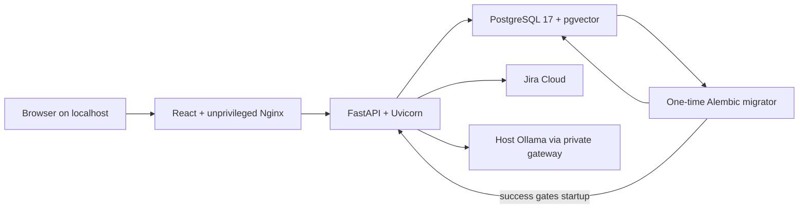
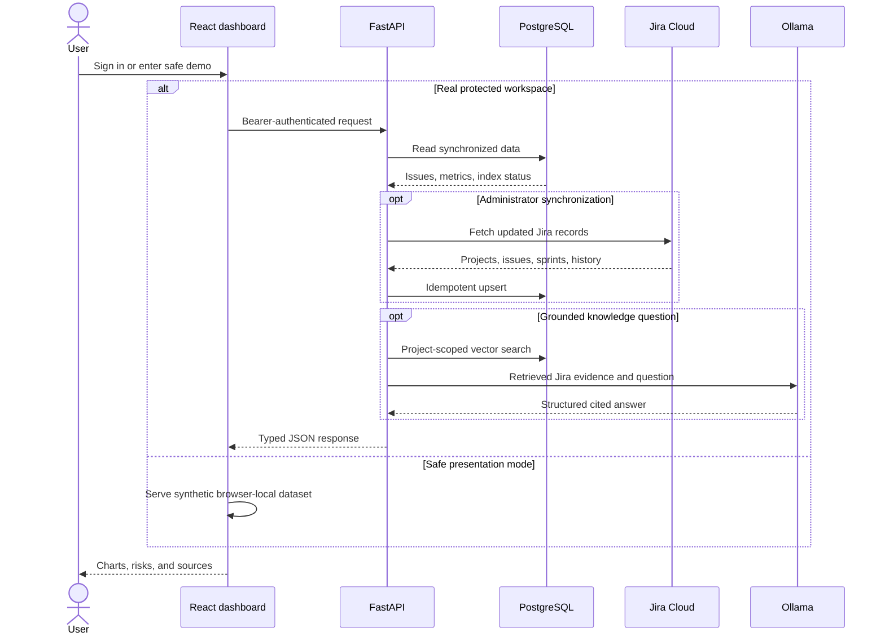

# Architecture

## Purpose

Jira AI Intelligence is a backend intelligence layer for Jira Cloud. Jira remains
the source of truth for project work. This application retrieves Jira data,
calculates deterministic delivery metrics, persists synchronized history, and
answers evidence-grounded questions with a local AI and RAG pipeline.

The current implementation covers Phases 1 through 12. It is an internship-quality
prototype, not yet a publicly deployable production service.

## Architectural principles

- Keep HTTP routes thin.
- Keep Jira-specific JSON inside the integration boundary.
- Calculate facts deterministically instead of asking an LLM to calculate them.
- Use synchronized storage to reduce repeated Jira calls.
- Keep AI evidence project-scoped and traceable.
- Validate every model citation against real Jira issue keys.
- Make synchronization and indexing idempotent.
- Report missing evidence rather than inventing values.
- Keep secrets outside source control.
- Authorize every project, sprint, and issue through one centralized policy.

## Main runtime components

### FastAPI application

`main.py` creates the application, configures logging, includes the `/api` router,
and exposes `/health` and `/ready`.

FastAPI provides request validation, dependency injection, OpenAPI generation,
Swagger UI, and response-model validation.

### API routes

`app/api/routes.py` is the authenticated composition root. It combines focused
routers for live Jira reads, analytics, synchronization, database-backed reads,
local AI, and RAG operations:

- `app/api/jira_routes.py`
- `app/api/analytics_routes.py`
- `app/api/sync_routes.py`
- `app/api/stored_routes.py`
- `app/api/intelligence_routes.py`

Routes validate HTTP input and delegate work to services. They do not contain the
main analytics or persistence algorithms.

### Jira integration

`JiraClient` owns HTTP communication with Jira Cloud. It handles authentication,
endpoint-specific pagination, response cleaning, timeouts, permission failures,
missing resources, invalid JSON, and safe logging.

`JiraService` provides application-level Jira operations and combines cleaned
Ticket objects with deterministic analytics.

### Analytics

`AnalyticsService` contains pure calculations over already-fetched Ticket
objects. It never calls Jira or the database.

It calculates current-state distributions, project activity, historical flow
metrics, overdue work, blocked signals, sprint completion, throughput, velocity,
lead time, cycle time, carryover, and scope changes.

`RiskService` is the single rule engine for delivery warnings. Risk Center and
the AI risk API consume its blocked, overdue, stale, unassigned,
workload-concentration, and low-completion signals, so UI thresholds cannot
drift away from backend explanations.

### Persistence

SQLAlchemy repositories store normalized project data. Alembic migrations version
the schema. SQLite supports lightweight tests and local development. PostgreSQL
is the production-like runtime database and is required for pgvector RAG storage.

### Project and team authorization

The prototype models one company with multiple Scrum teams. A project has one
owning team, a team may own multiple projects, and a user may belong to multiple
teams. Active team membership grants read access to the owning team's projects.
An explicit project-administrator assignment grants synchronization and RAG
indexing for that project without granting company-wide administration.

The company administrator creates teams, assigns project ownership, manages
memberships, and grants or revokes project administrators. Scrum responsibilities
such as developer, QA, product owner, and Scrum master are metadata; they do not
silently grant security privileges.

`AccessService` is the centralized policy. FastAPI dependencies apply it to
project paths and resolve stored sprint or issue identifiers back to their parent
project. `/api/projects` returns only synchronized projects authorized for the
current user, so knowing or guessing a Jira key cannot unlock a project.

### Synchronization

`SyncService` performs manual full and incremental synchronization.

A full sync stores:

- The selected Jira project.
- All project issues.
- Issue changelogs.
- Issue comments.
- Matching project boards and sprints.
- Sprint-to-issue memberships.
- Observable sync-run counts and status.

Incremental sync uses the latest successful completion timestamp as a UTC minute
watermark and refreshes recently updated issues. Without a baseline, it falls
back to full synchronization.

Each processed issue also creates a `sync_changes` audit record. The record says
whether the synchronized snapshot was created, updated, or unchanged; lists the
fields that differ; stores bounded before/after values; and records how many
changelog histories and comments were inspected. Older runs created before this
schema remain valid but naturally have no issue-level detail.

A freshness check requests only Jira's latest-updated issue and compares its
timestamp with that issue's stored copy. The result is cached on the project for
60 seconds, so dashboards may poll the local endpoint every 15 seconds without
calling Jira for every user. A project administrator can force an immediate
check. Successful synchronization clears the pending-update signal.

### Stored data

`StoredDataService` reads synchronized data without constructing a Jira client.
Stored analytics remain available even when Jira is slow or temporarily
unavailable.

Stored routes are the canonical product read model. The older live analytics
routes are deprecated diagnostics retained for troubleshooting and backward
compatibility; they are not used by dashboard screens.

### Grounded AI

`EvidenceService` builds a minimal, project-scoped evidence package from stored
data. `AIService` separates deterministic delivery-risk answers from generated
non-risk explanations.

Risk facts and recommendations are produced by the shared `RiskService` rules.
The local model cannot invent a new risk target. Unknown issue citations are
removed. Risk Center is the user-facing home for those signals; the Assistant
focuses on Jira content and meaning.

Structured sprint-list and issue-count questions are routed to deterministic
Jira analytics before embeddings or the LLM are called. RAG is not treated as an
authoritative source for relational sprint membership.

### RAG

The RAG pipeline contains:

- Deterministic chunking for summaries, descriptions, and comments.
- Stable SHA-256 chunk identities.
- `nomic-embed-text` embeddings served by Ollama.
- PostgreSQL pgvector storage.
- Project-filtered cosine retrieval.
- Top-ten grounded answer generation through `llama3.2`.
- Citation filtering and insufficient-evidence fallback.
- Answer-bound evidence: the answer response includes the exact retrieved
  passages supporting its validated citations, preventing a second search from
  displaying different evidence.
- A five-case Recall@K and Mean Reciprocal Rank evaluation.

## Data flows

### Live Jira analytics

```text
Client
  -> FastAPI route
  -> JiraService
  -> JiraClient
  -> Jira Cloud REST API
  -> cleaned Ticket models
  -> AnalyticsService
  -> validated JSON response
```

### Full synchronization

```text
POST sync request
  -> SyncService
  -> JiraService and JiraClient
  -> Jira project, issues, changelogs, comments, sprints
  -> JiraRepository upserts and snapshot replacement
  -> PostgreSQL transaction
  -> completed or sanitized failed SyncRun
```

### Stored analytics

```text
Client
  -> stored API route
  -> StoredDataService
  -> JiraRepository
  -> PostgreSQL
  -> Ticket models and histories
  -> AnalyticsService
  -> response without a Jira network call
```

Stored data is the dashboard's default read path. Overview, issues, project
history, sprint portfolio, sprint membership, risk explanations, workload, and
AI evidence all use the synchronized database snapshot. Live Jira calls are
reserved for explicit synchronization and freshness checks. This keeps ordinary
navigation fast and predictable and prevents a temporary Jira outage from
breaking already synchronized views.

### Grounded project AI

```text
Question
  -> stored project evidence
  -> deterministic risk engine for risk questions
     OR local llama3.2 for explanatory questions
  -> source-key filtering and known limitations
  -> grounded response
```

### RAG indexing

```text
Stored issues and comments
  -> summary, description, and comment chunks
  -> search_document-prefixed embeddings
  -> project-scoped pgvector upsert
  -> stale chunk removal within that project
```

### RAG answering

Before semantic retrieval, the question router checks for explicit Jira issue
keys and structured sprint questions. Explicit keys use exact, project-scoped
PostgreSQL lookup; sprint lists and counts use deterministic sprint analytics.
Only genuinely semantic issue-content questions proceed to embeddings, pgvector,
and the local answer model. This ordering prevents approximate retrieval from
overriding an exact identifier supplied by the user.

Semantic listing questions use embeddings and pgvector but format the bounded
matches deterministically. Results are deduplicated by issue key, limited to
five, required to score at least 0.5, and required to remain within 0.12 of the
best candidate. This separates retrieval from generation and avoids contradictory
answers that cite every candidate while claiming none are relevant.

```text
Question
  -> search_query-prefixed embedding
  -> project-filtered cosine retrieval
  -> top 10 chunks
  -> local llama3.2 structured answer
  -> citation allowlist
  -> grounded answer or insufficient-evidence response
```

## Database model

### projects

Stores Jira project ID, key, name, synchronization time, and optional owning
Scrum team.

### teams and team_memberships

Store Scrum teams and active user membership. A membership can record a Scrum
responsibility for administration and presentation.

### project_administrators

Stores explicit, revocable per-project administration grants and the granting
user. These identities may synchronize and rebuild knowledge for that project
only.

### issues

Stores normalized issue fields including status category, assignee, dates, story
points, labels, and Atlassian Document Format descriptions.

### sprints and sprint_issues

Store sprint metadata and relational membership between issues and sprints.

### changelogs

Store Jira history entries used for completion history, lead time, cycle time,
sprint changes, and carryover.

### comments

Store Jira comment IDs, issue ownership, author, body, and timestamps. Comment
snapshots are replaced idempotently per issue.

### sync_runs

Store mode, status, timestamps, processed counts, and sanitized failures.

### sync_changes

Stores the issue-level audit details associated with a synchronization run,
including field differences and inspected evidence counts.

### rag_chunks

Store chunk text, source metadata, content hashes, timestamps, and
768-dimensional vectors.

## Technology choices

- Python 3.12 for the application and AI ecosystem.
- FastAPI and Pydantic for typed HTTP contracts.
- Requests for Jira and Ollama HTTP calls.
- SQLAlchemy and Alembic for persistence and migrations.
- PostgreSQL 17 for production-like storage.
- pgvector 0.8.2 for vector similarity search.
- Ollama for free local model serving.
- `llama3.2` for generation.
- `nomic-embed-text` for embeddings.
- pytest for isolated and regression verification.
- Docker Compose for the reproducible application and PostgreSQL infrastructure.

## Container deployment architecture



Compose publishes the dashboard, API, and database only on `127.0.0.1` for the
internship prototype. The API and dashboard run as non-root users. PostgreSQL
must become healthy and the migration job must succeed before FastAPI starts;
Nginx then waits for FastAPI health. This prevents serving a partially migrated
application.

The browser uses one dashboard origin. Nginx serves static React assets and
reverse-proxies backend paths over the private Compose network. Ollama remains a
host-managed service because local GPU configuration differs between developer
machines and should not be hidden inside the application image.

## Reliability and security boundaries

The complete Phase 12 threat model, privacy assessment, residual risks, and
production requirements are maintained in [security.md](security.md).

- Jira and Ollama errors are sanitized before reaching clients.
- Logs record safe resource paths, status, duration, and error category.
- Raw Jira bodies and credentials are not logged.
- Configuration is loaded from ignored environment files.
- JQL is constructed only from validated allowlisted fields.
- AI questions and retrieved Jira text are treated as untrusted data.
- RAG retrieval is filtered by project key.
- Model citations are checked against supplied evidence.

Local JWT authentication identifies prototype users whose passwords are stored
only as Argon2 hashes. Identity, active state, global role, team membership, and
project-administrator grants are checked against PostgreSQL. Team members read
only their teams' projects; synchronization and RAG indexing additionally need
project administration. Explicit CORS origins and process-local rate limits reduce
accidental exposure and abuse. Production would replace local identity with
company SSO/OIDC and move rate limiting to shared infrastructure.

User records also carry optional first name, last name, and unique email fields.
These fields improve accountability and presentation without changing the JWT
authorization contract. Existing username-only records remain valid.

Every browser session polls a minimal project freshness endpoint every 15
seconds. That endpoint exposes only the last completed sync ID and timestamp.
When a new ID appears, TanStack Query invalidates the selected project's cached
views and refetches shared PostgreSQL-backed facts. Therefore an administrator's
sync changes the common dataset, while each open Team Member browser discovers
and displays it without permission to trigger synchronization.

## Verified state

- Verified clean SQLite migration head: `20260805_08`.
- Latest full T1 sync: 20 issues, 3 sprints, 80 changelogs, 0 comments.
- Latest RAG index: 20 chunks.
- Automated suite: 147 passed, with 2 PostgreSQL-only tests skipped when their
  explicit integration database variable is absent.
- Retrieval evaluation: Recall@K `1.0`, MRR `0.8333`.
- Grounded RAG answer correctly selected and cited T1-22.

## Dashboard request flow



The demo branch is deliberately isolated from FastAPI business data. It is for
presentations where company Jira content cannot be displayed; it does not bypass
backend authorization for real endpoints.

## Known limitations

- Prototype authentication is local rather than company SSO/OIDC.
- Authorization is role-based and project-specific inside one modeled company;
  true multi-company tenancy is not implemented.
- Rate limiting is process-local and is not shared across multiple workers.
- No automatic sync scheduler.
- The React dashboard and private Compose deployment are implemented. Public
  production hosting is intentionally deferred; automated browser end-to-end
  tests remain for later phases.
- Small five-question retrieval evaluation set.
- Short summaries reduce raw semantic ranking quality.
- Retrieval quality depends on the summaries, descriptions, and comments that
  the selected Jira project actually contains.
- Production monitoring, deployment hardening, backups, and CI/CD remain.

See [API documentation](api.md), [Postman guide](postman-get-routes.md),
[roadmap](roadmap.md), [research references](research.md), and
[the project defense guide](../KEEPUP.md).
