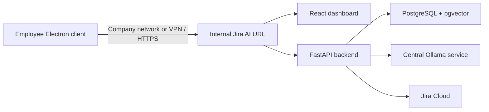

# Windows desktop client

The Jira AI Intelligence desktop client is a secure Electron shell for the
centrally hosted application. It does not contain Jira credentials, PostgreSQL,
Ollama models, or synchronized company data.

## What the executable does

- Starts when an installed user signs in to Windows.
- Prevents duplicate application instances.
- Checks the configured company health endpoint before loading the workspace.
- Shows a clear company-network or VPN message when the service is unreachable.
- Retries the connection without requiring an application restart.
- Loads only the configured dashboard origin inside the Electron window.
- Opens permitted external HTTPS links in the user's normal browser.
- Denies renderer access to Node.js, Electron internals, and browser permissions.

The connection gate checks application availability, not general internet
access. A computer may have internet access and still require the company VPN to
reach the internal Jira AI Intelligence service.

## Local internship demonstration

The demo deployment runs the platform on the same computer:

```powershell
docker compose up -d
ollama serve
```

The desktop client defaults to `http://127.0.0.1:3000`. If Compose is stopped,
the executable still opens but displays the network-required page because the
actual dashboard and API are unavailable.

Build and install the Windows client from `desktop`:

```powershell
npm ci
npm run check
npm test
npm run make
```

Versioned installers are written under:

```text
desktop-dist/<version>/make/squirrel.windows/x64/JiraAIIntelligenceSetup.exe
```

## Company deployment

In a company, the frontend, FastAPI backend, PostgreSQL/pgvector database,
Ollama services, and Jira credentials run centrally. Employees install only the
Windows client. The target architecture is:



Company IT creates this non-secret configuration file on each managed machine:

```text
C:\ProgramData\Jira AI Intelligence\desktop-config.json
```

Example contents:

```json
{
  "dashboardUrl": "https://jira-ai.company.example",
  "healthcheckUrl": "https://jira-ai.company.example/container-health"
}
```

The file contains service locations only. Passwords, JWT secrets, Jira tokens,
and database credentials must never be placed in it.

For development or controlled troubleshooting, these environment variables
override the machine file:

- `JIRA_AI_DESKTOP_URL`
- `JIRA_AI_HEALTH_URL`
- `JIRA_AI_CONFIG_FILE`

The production dashboard should use internal HTTPS with a certificate trusted
by company-managed Windows devices.

## Windows behavior

The installed Squirrel application registers its stable launcher as a Windows
login item. Development and portable builds deliberately do not modify startup
settings. Opening a second copy focuses the existing window instead of creating
another authenticated session window.

Release 1.0.4 also removes the obsolete login-item name used by early prototype
installers. Electron hardware acceleration is disabled because a tested Windows
GPU driver produced visible Chromium compositor artifacts on the local fallback
page. Software rendering is sufficient for this dashboard and avoids displaying
stale or corrupted visual regions.

The application and installer use the Jira AI Intelligence icon. A production
release should additionally be signed with the company's Windows code-signing
certificate so employees see a verified publisher instead of an unknown
publisher warning.

## Verification checklist

1. Start the central or local services and open the installed client.
2. Confirm the checking screen transitions to login.
3. Open the app twice and confirm only one window remains.
4. Stop the frontend service and reopen the app.
5. Confirm the network-required page appears.
6. Restore the frontend and select **Retry connection**.
7. Confirm the login page opens without restarting Electron.
8. Verify Jira AI Intelligence appears in Windows Startup Apps.
9. Test one administrator and one team-member account.
10. Confirm the AI failure state does not block non-AI dashboard pages.

## Known production follow-ups

- Sign the executable and installer.
- Distribute the installer and configuration through company device management.
- Add controlled automatic updates after a trusted internal release channel is
  available.
- Replace prototype local accounts with company SSO/OIDC.
- Monitor the central health endpoint and backend dependencies independently.
